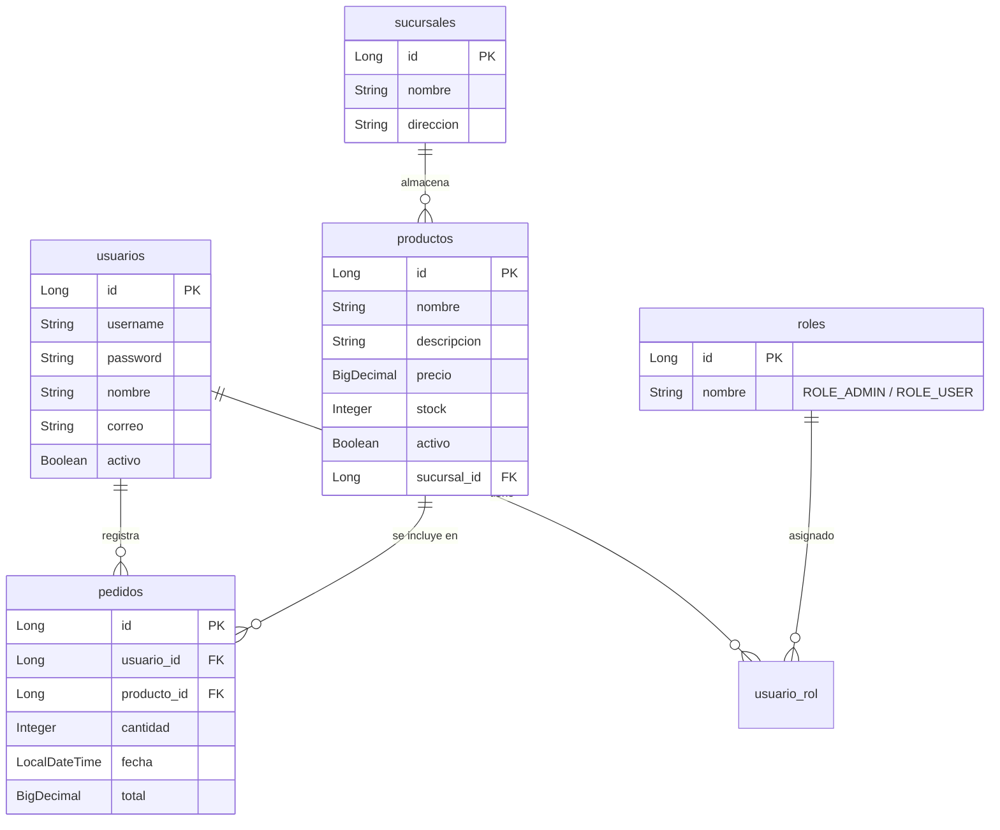

# Sistema Tambo - Gestión de Inventario y Pedidos

Este proyecto es una plataforma web completa de nivel empresarial diseñada para la administración centralizada de inventarios, registro de ventas y visualización de analíticas operativas de las sucursales de tiendas **Tambo**.

---

## 🚀 Enlaces de Producción (Despliegue en la Nube)

* **Frontend (Angular)**: `https://tambo-frontend.vercel.app` (Ejemplo - Reemplazar con URL final)
* **Backend API (Spring Boot)**: `https://tambo-backend.onrender.com` (Ejemplo - Reemplazar con URL final)
* **Base de Datos (MySQL)**: Hospedada en Clever Cloud.

---

## 🛠️ Arquitectura y Tecnologías

El sistema implementa una arquitectura desacoplada y moderna de tipo SPA (Single Page Application):

```mermaid
graph TD
    subgraph Cliente (Frontend)
        A[Angular 21 + TypeScript] -->|Estilos Atómicos| B[Tailwind CSS v4]
        A -->|Gestión del Estado| C[RxJS Observables]
        A -->|Middleware de Red| D[HttpInterceptor JWT]
    end

    subgraph Servidor (Backend)
        E[Spring Boot REST API] -->|Seguridad y Filtros| F[Spring Security]
        E -->|Mapeo de Datos| G[DTOs / Entidades JPA]
        E -->|Acceso a Datos| H[Spring Data JPA]
    end

    subgraph Base de Datos
        I[(MySQL Cloud)]
    end

    D -->|HTTPS + Token JWT| F
    H -->|Drivers JDBC| I
```

### Tecnologías Utilizadas:
* **Frontend**: Angular 21 (Modo Zoneless), Tailwind CSS v4, RxJS, HTML5 y TypeScript.
* **Backend**: Spring Boot 3.2.5, Spring Security, JWT (Json Web Token), Hibernate, JPA y Java 17.
* **Base de Datos**: MySQL.

---

## 📊 Diagrama Entidad-Relación (Base de Datos)

El modelo de datos se estructura bajo una lógica relacional optimizada:



---

## 📑 Catálogo de la API REST

Todas las peticiones del frontend se comunican con los siguientes endpoints del backend:

| Módulo | Endpoint | Método | Acceso | Descripción |
| :--- | :--- | :--- | :--- | :--- |
| **Auth** | `/api/auth/login` | `POST` | Público | Autentica credenciales y retorna el token JWT y datos de sesión. |
| **Productos** | `/api/productos` | `GET` | Autenticado | Retorna los productos de la sucursal activa (vía `?sucursalId=X`). |
| **Productos** | `/api/productos/buscar` | `GET` | Autenticado | Filtra productos por nombre y sucursal. |
| **Productos** | `/admin/productos` | `POST` | Administrador | Registra un nuevo producto en la sucursal activa. |
| **Productos** | `/admin/productos/{id}` | `PUT` | Administrador | Modifica datos del producto. |
| **Productos** | `/admin/productos/{id}` | `DELETE` | Administrador | Realiza la baja lógica (`activo = false`) del producto. |
| **Pedidos** | `/api/pedidos` | `POST` | Autenticado | Registra una venta reduciendo stock físico en inventario. |
| **Pedidos** | `/api/pedidos` | `GET` | Autenticado | Lista todos los pedidos registrados en orden cronológico descendente. |
| **Usuarios** | `/usuarios` | `GET` | Autenticado | Lista los usuarios del sistema. |
| **Usuarios** | `/usuarios` | `POST` | Administrador | Registra un nuevo usuario con rol administrativo o empleado. |
| **Sucursales** | `/api/sucursales` | `GET` | Autenticado | Obtiene la lista de las 3 sucursales registradas (Miraflores, San Isidro, Surco). |
| **Dashboard** | `/api/dashboard/stats` | `GET` | Autenticado | Calcula KPIs (Ventas, alertas de stock bajo y Top 5 productos) de la sucursal. |

---

## 🛠️ Guía de Instalación y Ejecución Local

### Prerrequisitos:
* **Java 17 (JDK)** instalado y configurado en variables de entorno.
* **Node.js** (versión LTS) para compilar Angular.
* **MySQL Server** corriendo localmente con base de datos `tambo_db` (o configurado en `application.properties`).

### Pasos de Ejecución rápida:
1. Clona el proyecto y ve a la raíz:
   ```bash
   cd SistemaTambo
   ```
2. Ejecuta el script automatizado en PowerShell:
   ```powershell
   .\run-tambo.ps1
   ```
3. Abre tu navegador en **`http://localhost:4200`** e inicia sesión con las cuentas semilla:
   * **Admin**: usuario: `admin` | contraseña: `admin123`
   * **Empleado**: usuario: `empleado` | contraseña: `empleado123`
